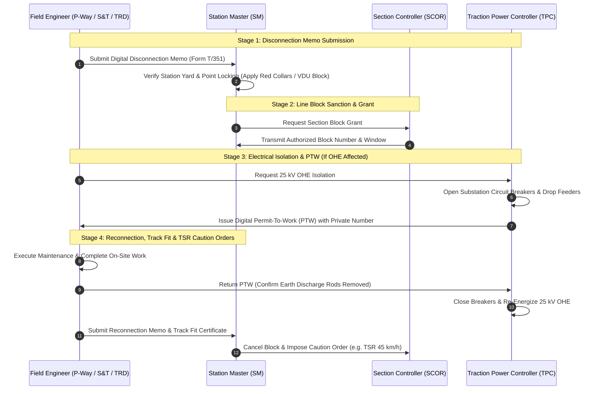

# Standard Operating Procedure (SOP): Station Master & Field Operator Manual
**Indian Railways | General & Subsidiary Rules (G&SR) Compliance Manual**
**Target Roles**: Station Master (SM), Section Controller (SCOR), Traction Power Controller (TPC), Junior Engineer / Permanent Way (JE/P-Way), Signal Inspector (SSE/Sig).

---

## 1. Regulatory Context & Statutory Framework
Under the Indian Railways Act, 1989 and General & Subsidiary Rules (G&SR), **no physical obstruction or interruption of traction/signalling equipment may occur without an irrevocable, auditable safety handshake**.

The AI Corridor Platform digitizes this four-stage legal protocol, replacing error-prone manual paper memos with cryptographically validated digital handshakes.

---

## 2. Four-Stage Statutory Safety Lifecycle

---

## 3. Detailed Stage Operational Guide

### Stage 1: Station Master Disconnection Memo (Form T/351)
1. **Accessing the Console**:
   - Log into the Station Master portal at `/station-master` or navigate from the top switcher.
2. **Receiving Disconnection Request**:
   - The field supervisor (JE/P-Way or SSE/Sig) submits the digital disconnection request for points, track circuits, or level crossing interlockings.
3. **Verification & Lever Collar Application**:
   - The Station Master verifies that no train movement is authorized into the targeted station or block section.
   - On the Electronic Interlocking (EI) VDU console, apply electronic point collars / red reminder collars to block signal levers.
4. **Digital Signature**:
   - Click **"Endorse & Sign Disconnection Memo"**.
   - The system generates an unalterable timestamped memo record (e.g., `MEMO-GZB-DEMO-01`).

---

## 4. Stage 2: Section Controller Block Grant
1. The Section Controller reviews the corridor line status.
2. When the block section is physically cleared of running trains, the SCOR grants the **Line Block**.
3. The Section Controller issues an exchange Private Number to both adjoining Station Masters.
4. Block instruments are set to `Line Blocked` or Electronic Interlocking block keys are extracted.

---

## 5. Stage 3: Traction Power Controller (TPC) Permit-To-Work (PTW)
*Applicable whenever Civil or TRD maintenance occurs within 2.0 meters of live 25 kV AC overhead lines.*

1. **Isolation Verification**:
   - TPC logs into the electrical dispatch console.
   - Remotely trips the corresponding 25 kV vacuum circuit breakers at the feeding post/substation.
2. **Earthing Rod Verification**:
   - Field TRD staff fix portable earthing discharge rods on both sides of the maintenance sector to ground induced voltages.
3. **Permit-To-Work (PTW) Issuance**:
   - TPC enters the feeder isolation zone identifier and clicks **"Issue PTW"**.
   - A unique PTW code (e.g., `PTW-OHE-DEMO-99`) is transmitted to the site supervisor.
   - **G&SR Rule 17.03**: No physical work on tracks or OHE structures shall commence until this digital PTW is in the possession of the site supervisor.

---

## 6. Stage 4: Work Completion, Reconnection & Track Fit Certification

### Step 1: Return of Electrical PTW
1. Field supervisor confirms:
   - All men and materials are cleared from the track and traction structure.
   - Earth discharge rods are detached.
2. Supervisor clicks **"Return PTW"**.
3. TPC confirms and safely restores 25 kV power to the overhead catenary.

### Step 2: Track Fit Certification & Reconnection Memo
1. Field Civil/S&T engineer issues the **Track Fit Certificate** guaranteeing:
   - Gauge, cross-level, and ballast compaction meet IRPWM safety limits.
   - Point machine electronic detection switches are aligned.
2. Station Master receives the Reconnection Memo:
   - Tests signals and point operations in tandem with the maintainer.
   - Signs **"Accept Reconnection & Resume Traffic"**.

### Step 3: Temporary Speed Restriction (TSR) Caution Orders
1. If the maintenance involved ballast disturbance (e.g., tamping or deep screening), the system automatically prompts:
   - **Caution Order Window**: e.g., `TSR 45 km/h` for the next 2 hours or first 3 trains.
2. Station Master issues Caution Orders to oncoming Loco Pilots via the automated FOIS/CMS interface.
3. Normal train dispatch is officially restored.
